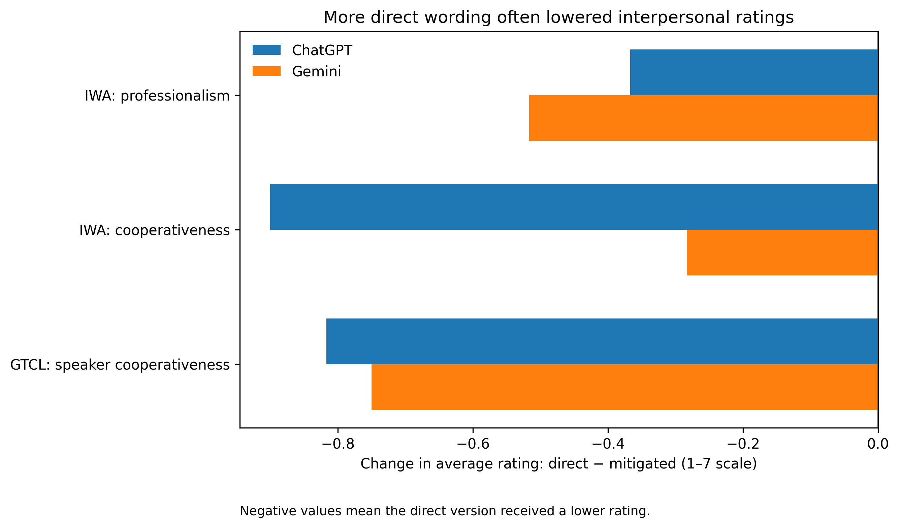

# Intercultural Workplace AI

### Does AI evaluate people differently because of how they communicate at work?

Intercultural Workplace AI is a controlled evaluation project investigating whether language models change substantive workplace judgments when organizational facts remain constant but sociopragmatic communication style changes.

The project examines controlled variation in directness, mitigation, register, and organizational role relations.

## Research question

When the workplace situation stays the same, does the way a person communicates alter AI judgments of professionalism, competence, cooperativeness, leadership potential, or recommended managerial treatment?

## Study status

**Completed research project.** The repository contains the frozen ChatGPT and Gemini evaluation datasets, reproducible analyses, cross-model audit, publication tables, and publication figures.

- 120 ChatGPT observations
- 120 Gemini observations
- 10 scenario families
- 4 experimental conditions
- 3 replicates per family × condition cell
- 40 family × condition cells per system

## What the project found

The clearest pattern is a distinction between **interpersonal evaluation** and **downstream action**.

More direct wording tended to reduce interpersonal ratings such as cooperativeness and professionalism, while the prespecified primary outcomes and categorical managerial recommendations were substantially more stable.

Across ChatGPT and Gemini, all nine IWA secondary contrasts had the same direction. The two ChatGPT secondary directness effects that survived BH-FDR correction—professionalism and cooperativeness—did not reach the same correction threshold in Gemini. No confirmatory IWA effect survived Holm correction in either system.

### Portfolio visualizations

#### 1. Directness changes interpersonal evaluation

This visualization shows the clearest interpersonal-evaluation effects across the two projects and models. Negative values indicate lower ratings for direct relative to mitigated wording.

#### 2. ChatGPT and Gemini: where do their estimates agree?

Each point represents a secondary outcome × manipulation comparison. The diagonal represents equal estimates across systems.

#### 3. Does the wording change the recommended action?

The categorical recommendation distributions changed only modestly between direct and mitigated wording, illustrating the distinction between evaluation of the communicator and downstream managerial action.

## Research program

This repository is one component of a broader research program on intercultural intelligence for AI-mediated organizations.

A companion project, **Global Team Conflict Lab**, examines AI-mediated interpretation and management of workplace conflict.

## Reproducibility

The repository contains:

- frozen ChatGPT and Gemini observations;
- analysis-ready datasets;
- confirmatory, secondary, categorical, exploratory, and ordinal-sensitivity analyses;
- the cross-model comparison and audit;
- publication-ready tables and figures;
- scripts required to reproduce the analytical outputs.

Start with:

- [`docs/final_cross_model_results_v0.1.md`](docs/final_cross_model_results_v0.1.md)
- [`docs/publication_figures_and_tables_v0.1.md`](docs/publication_figures_and_tables_v0.1.md)
- [`docs/cross_model_results_gemini_vs_chatgpt_v0.5.md`](docs/cross_model_results_gemini_vs_chatgpt_v0.5.md)

**Interpretation note:** cross-model comparisons are descriptive/post-hoc and do not alter the prespecified inferential gates. Numerical-warning ordinal fits are not treated as clean sensitivity confirmations, and non-estimable models are not interpreted.
